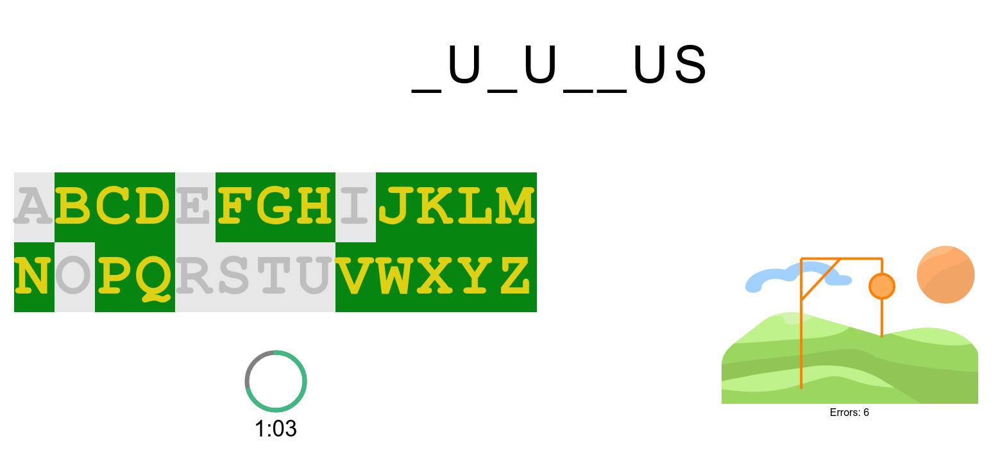

# Hangman

This Git repository was created for testing purposes, but the software in it is working. It is a small Javascript project that implements the well-known word game called the hangman.

Hangman is a paper and pencil guessing game for two or more players. One player thinks of a word, phrase or sentence and the other(s) tries to guess it by suggesting letters within a certain number of guesses.

The word to guess is represented by a row of dashes, representing each letter of the word. In most variants, proper nouns, such as names, places, and brands, are not allowed. Slang words, sometimes referred to as informal or shortened words, are also not allowed. If the guessing player suggests a letter which occurs in the word, the other player writes it in all its correct positions. If the suggested letter does not occur in the word, the other player draws one element of a hanged man stick figure as a tally mark.

To start the game you need a web server. You can also launch it using Python:
```
# cd <hangman directory>
# python -m http.server
```

Press F1 for a short help and F2 to start the game.


